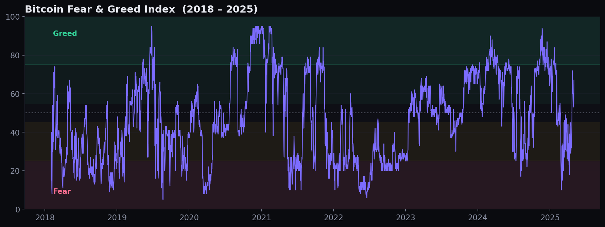
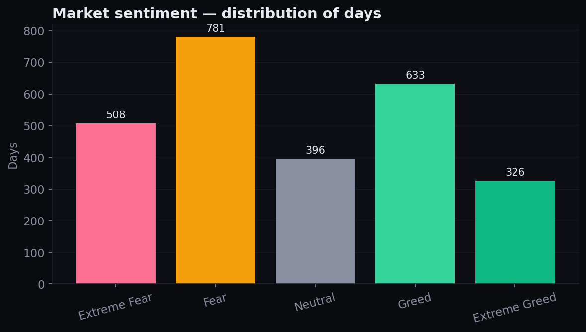

<div align="center">

# ₿ Bitcoin Market Sentiment vs Trader Performance

### Does fear & greed actually move traders' P&L? A data-analysis deep-dive.


</div>

---

## 📌 Overview

This project investigates **how Bitcoin market sentiment (the Fear & Greed Index) influences
trader profitability and risk behaviour.** It merges day-by-day sentiment with **real
trade-level records from the Hyperliquid exchange**, then analyses profitability, risk and
trading activity across **Fear, Neutral and Greed** regimes.

The goal: find out whether market psychology is a usable signal for **better entries, position
sizing and risk management** in crypto trading.

---

## 🗂️ Datasets

**1. Bitcoin Fear & Greed Index** (`fear_greed_index.csv`) — included in this repo
- **2,644 daily readings**, **Feb 2018 → May 2025**
- Columns: `timestamp`, `value` (0–100), `classification`, `date`
- Sentiment split: **~49% Fear days · ~36% Greed days**, average index **≈ 47/100**

**2. Hyperliquid Trader Data** (`historical_data.csv`) — trade-level
- Account, coin, execution price, size (tokens / USD), side, timestamp, **closed PnL**, fees
- Reflects real trader behaviour in live crypto markets

---

## 📊 Visual highlights

**Sentiment over seven years — the market swings hard between fear and greed:**



**How often the market sat in each mood:**



---

## 🔬 Method

1. **Clean** both datasets — consistent dates, numeric coercion, de-duplication.
2. **Integrate** — merge the Fear & Greed Index onto trader records by date.
3. **EDA by regime** — compare average & total **closed PnL**, win-rate, trade size and
   activity across Fear / Neutral / Greed.
4. **Statistics** — correlation and group tests to check whether differences are meaningful.

---

## 💡 Key insights

- **Trader performance varies materially across sentiment regimes** — the mood of the market
  coincides with measurable shifts in profitability.
- **Risk behaviour differs in Fear vs Greed** — position sizing and activity are not constant
  across regimes.
- **Sentiment is a usable context signal** — pairing the Fear & Greed Index with execution
  discipline can inform smarter risk management.

*(Full figures, tables and statistical tests are in the notebook.)*

---

## ▶️ Run it

```bash
git clone https://github.com/Namanjain723/Bitcoin-Sentiment-Trader-Analysis.git
cd Bitcoin-Sentiment-Trader-Analysis
pip install -r requirements.txt
jupyter notebook trader_sentiment_analysis.ipynb
```

> `fear_greed_index.csv` ships with the repo. To reproduce the merge/PnL analysis end-to-end,
> place the Hyperliquid `historical_data.csv` in the project folder (it is large and sourced
> from the exchange, so it is not committed here).

---

## 🧰 Tech stack

**Python · Pandas · NumPy · SciPy · Matplotlib · Jupyter Notebook**

---

## 👤 Author

**Naman Jain** — Data Analyst & AI Developer
🌐 [Portfolio](https://pixlforgestudio03.netlify.app/) · ✉️ namancric18@gmail.com · 🐙 [@Namanjain723](https://github.com/Namanjain723)
